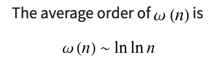

https://www.acmicpc.net/problem/11689

```
get all factors: sqrt(n)


```

https://mathworld.wolfram.com/DistinctPrimeFactors.html

(approximation of) number of prime factors:



+) max: (ln x) / (ln ln x) ([https://math.stackexchange.com/a/1676675](https://math.stackexchange.com/a/1676675))

huh urm ok

---

# 풀이

1. 모든 인수를 구함 ($O(n) = \sqrt n$)
2. 인수에서 소수만 분류 -> 소인수 구함* ($O(N_f \times N_{pf})$)*
3. 각 소수 p마다... ($\sum t \le O(N_f)$)
   1. 인수에서 $2 + np$번째 요소를 삭제

*: $N_f$ = 인수 갯수, $N_{pf}$ = 소인수 갯수.
이 부분의 정확한 시간 복잡도는 아직 잘 모르겠다. 더 공부해야할 듯
